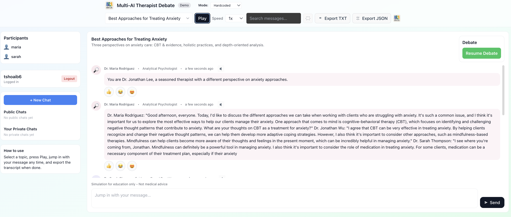

# Multi‑Chat AI Therapist (React + TypeScript + Vite)

A multi‑participant chat app where therapist‑style AI personas debate wellbeing topics. You can observe, search, save, and export transcripts — or join as a user. The app includes a Node/Express + SQLite backend with JWT auth.

## Features

- Three built‑in therapist personas that take turns debating a topic
- Join as the fourth speaker with your own messages
- Private and public chats, plus browsing of public sessions
- Save transcripts, export as TXT/JSON
- Login/Register with full name, JWT‑based authentication
- Tooltips and a quick onboard guide after first login
- Clean, responsive UI with light/dark theme

## Tech Stack

- Frontend: React 18, TypeScript, Vite, Tailwind CSS, Zustand, React Router
- Backend: Node.js (Express), SQLite3, JWT, bcrypt

## Monorepo layout

```
multi-chat-ai-app/
├─ public/
├─ src/              # React app
├─ server/           # Express + SQLite backend
├─ index.html        # App shell and favicon
├─ package.json      # Frontend scripts and deps
└─ server/package.json
```

## Getting started

1) Install dependencies

```bash
pnpm install  # or npm install / yarn
```

2) Start the backend (in another terminal)

```bash
cd server
pnpm install  # installs server deps if not already
pnpm dev      # starts Express on http://localhost:4000
```

3) Start the frontend

```bash
pnpm dev      # starts Vite on http://localhost:5173
```

Open http://localhost:5173 and click Login to get started.

### Docker

You can build a single image that serves both the API and the built UI via Express:

```bash
# Build image
docker build -t multi-chat-ai-app .

# Run container (maps port 4000)
docker run --rm -p 4000:4000 \
	-e OPENAI_API_KEY=your_openai_key \
	-e JWT_SECRET=supersecret \
	multi-chat-ai-app

# App will be available at http://localhost:4000
# Frontend is served at /, API is under /api
```

### Split containers (API and UI)

You can build and run the backend and frontend as separate containers:

**Backend (Express API):**
```bash
docker build -f Dockerfile.server -t multi-chat-ai-server .
docker run --rm -p 4000:4000 \
	-e OPENAI_API_KEY=your_openai_key \
	-e JWT_SECRET=supersecret \
	multi-chat-ai-server
```

**Frontend (Vite static build + Nginx):**
```bash
docker build -f Dockerfile.frontend -t multi-chat-ai-frontend .
docker run --rm -p 80:80 multi-chat-ai-frontend
```

**Usage:**
- The API will be at http://localhost:4000/api
- The UI will be at http://localhost (port 80)
- Update the API base URL in `src/api.ts` if you deploy to different hosts/ports.

## Environment

The frontend expects the backend at http://localhost:4000 (see `src/api.ts`). If you change the server port or host, update the `API` base URL in that file.

## Scripts

Frontend (`package.json`):
- `dev` – run Vite dev server
- `build` – typecheck and build production bundle
- `preview` – preview the production build
- `lint` – run ESLint

Backend (`server/package.json`):
- `dev` – start Express via nodemon
- `start` – start Express in production mode

## API Endpoints (brief)

Auth
- POST `/api/auth/login` – { username, password } → { token, user }
- POST `/api/auth/register` – { username, password, fullName } → { token, user }

Chats
- GET `/api/chat` – list private chats
- GET `/api/chat/public` – list public chats
- GET `/api/chat/:id` – fetch a chat (access: owner, participant, or public)
- POST `/api/chat` – save chat { title, topicId, messages, isPublic? }

Debate
- POST `/api/debate/start` – begin a debate for a topic
- POST `/api/debate/next` – next debate message/state

## Usage tips

- After registering or logging in, you’ll be redirected to the Chat page.
- Use the Topic picker to choose a theme. Start/stop a debate and let AIs discuss.
- Export your transcript as TXT/JSON from the top bar.
- Participants show full names when available.

## Assets & Branding

- App favicon and header logo use `src/assets/Multi.png`.
- You can replace this file to update branding. In `index.html`, the favicon link points to this asset.

## Troubleshooting

- “Cannot connect to API” – Ensure the backend is running on port 4000.
- Database issues – The SQLite DB is created automatically. Delete the DB file to reset if needed.
- CORS – The backend enables CORS for local dev; adjust for production as needed.


